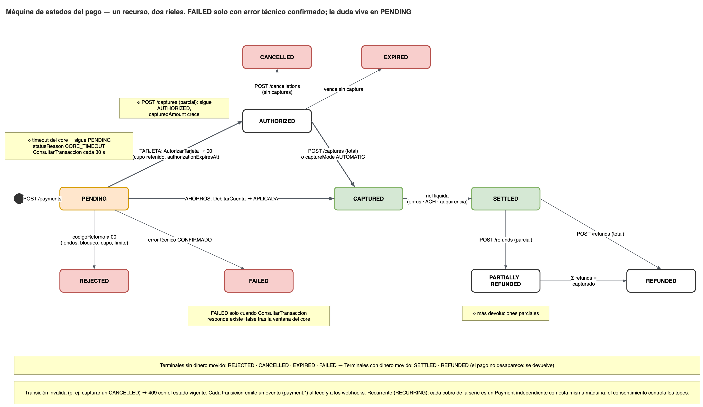
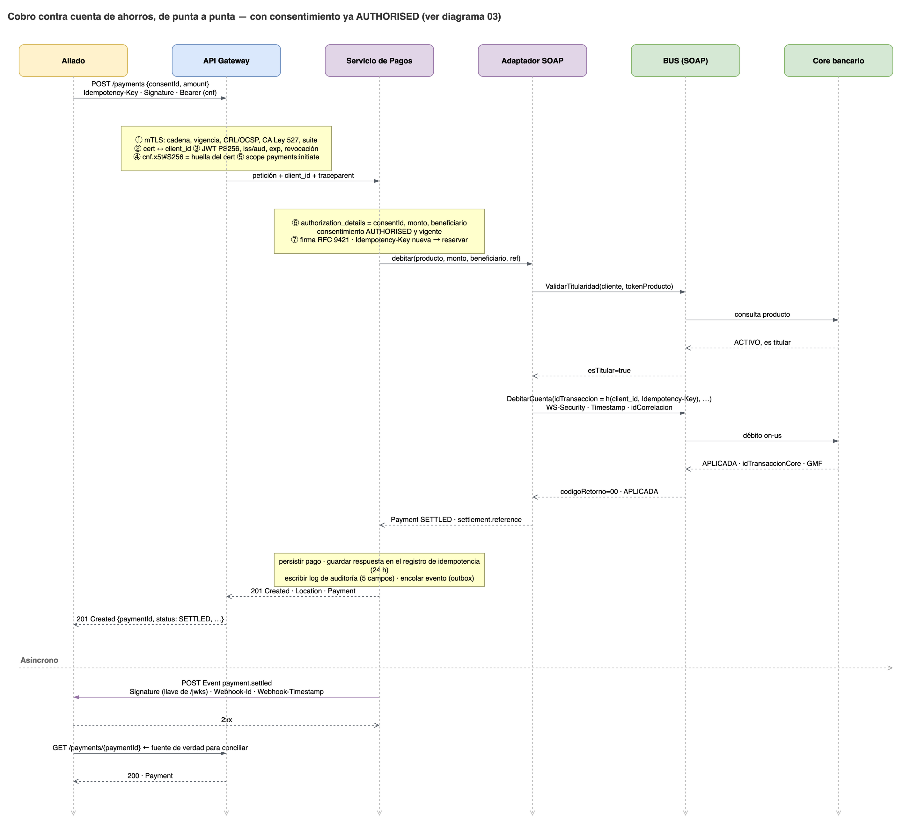
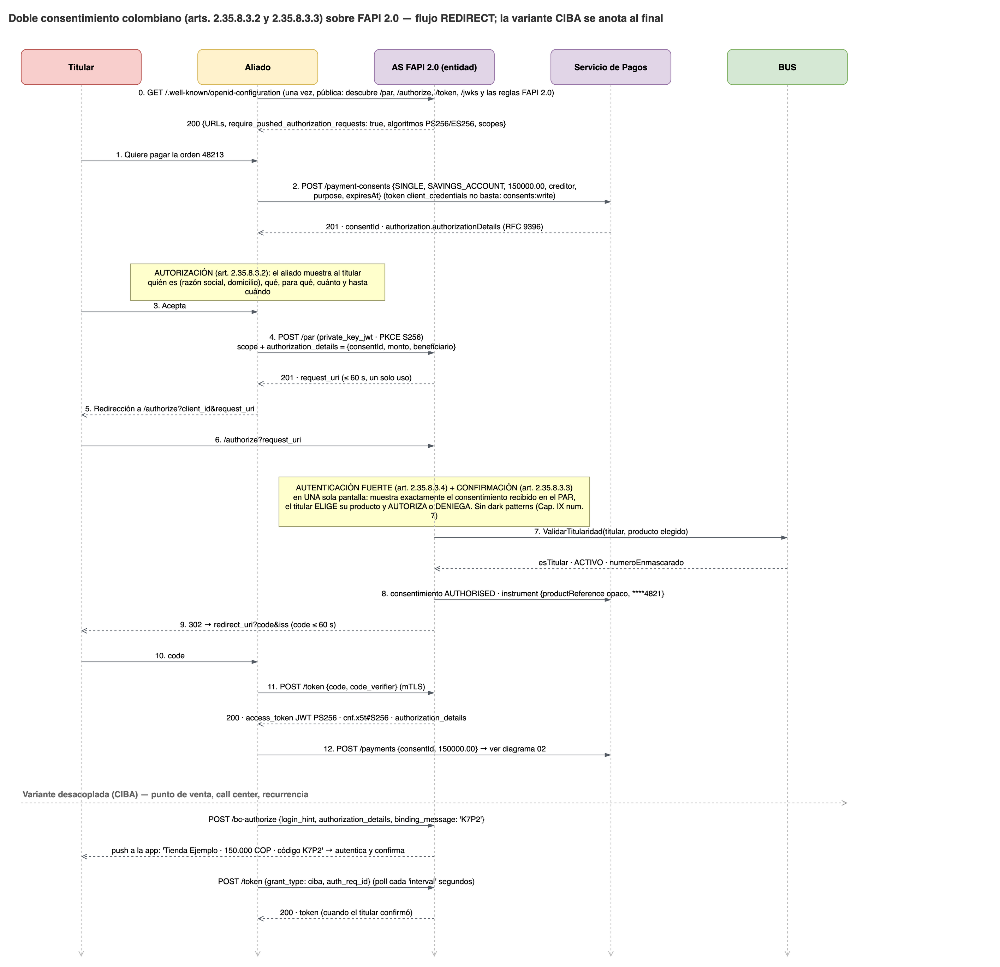
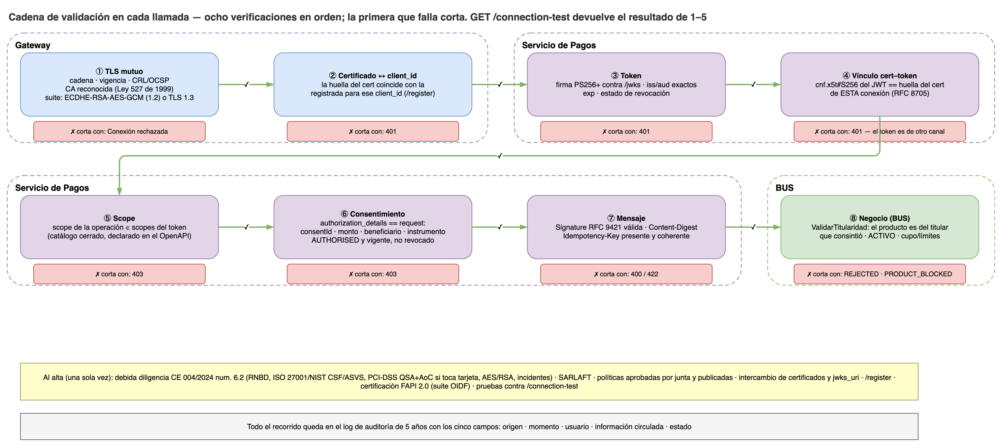
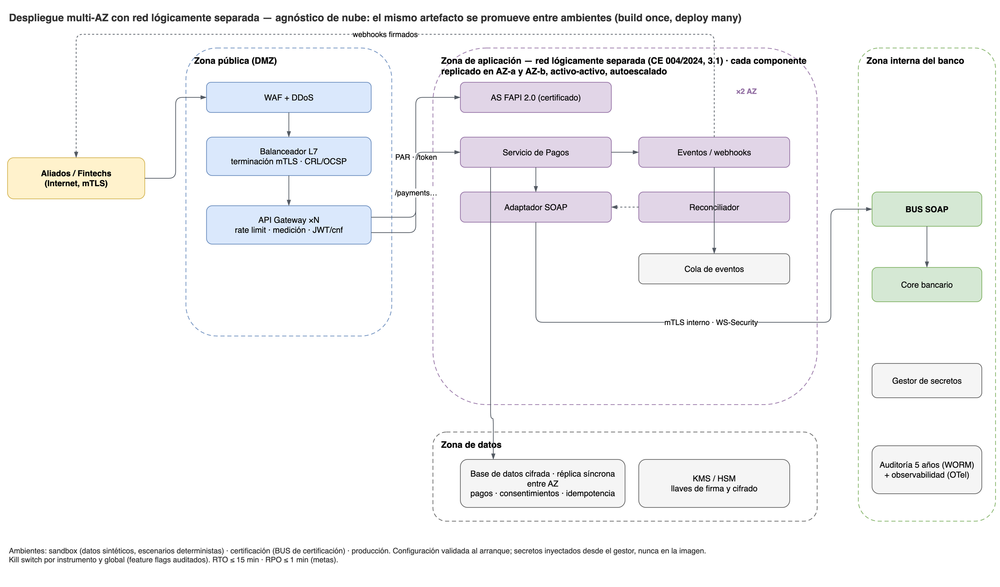

# Reto técnico — Integración de APIs de pago en un ecosistema Open Banking

**Respuestas al cuestionario · Fecha de corte normativa: 10 de septiembre de 2026**

> **Cómo leer este documento.** Cada sección responde una de las ocho preguntas del reto y
> se justifica con tres tipos de evidencia: el **contrato ejecutable**
> ([`api/openapi.yaml`](../api/openapi.yaml), validado y recorrido contra un mock), el
> **marco normativo colombiano vigente** ([`marco-normativo-aplicable.md`](./marco-normativo-aplicable.md),
> con cada afirmación respaldada en [`fuentes-verificadas.md`](./fuentes-verificadas.md)) y los
> **diagramas** en [`diagrams/`](./diagrams/). Lo que no pudo respaldarse no se afirma: se
> convierte en pregunta al equipo del BUS en la sección 4.

## Resumen ejecutivo — las cinco decisiones que sostienen el diseño

| # | Decisión | Por qué |
|---|---|---|
| 1 | **Un solo recurso `/payments` con dos rieles**, no dos APIs paralelas | Cuenta de ahorros (una fase) y tarjeta de crédito (autorización + captura) comparten el 80 % del ciclo de vida. Duplicarlo duplica errores, documentación y SDKs |
| 2 | **FAPI 2.0 puro** como perfil de seguridad, con los requisitos literales colombianos encima | La CE 004/2024 lo exige desde 2024 y el plazo venció el 7-ago-2026. Y la circular, al enumerar, omite PAR y tokens vinculados — implementar solo su lista literal **no** cumple FAPI 2.0 |
| 3 | **El aliado nunca autentica al cliente ni ve sus productos**: la entidad autentica, el titular elige y confirma, el aliado recibe una referencia opaca | Art. 2.17.4.1.3: la entidad emisora autentica al ordenante en todos los casos; el iniciador jamás accede a credenciales. Además reduce el alcance PCI a cero para el aliado |
| 4 | **Un timeout del core nunca es un `504`**: el pago existe en `PENDING` y se resuelve por consulta de referencia | El débito pudo ejecutarse. Responder error induce al aliado a reintentar y a cobrar dos veces. La operación `ConsultarTransaccion` del BUS es el insumo **bloqueante** del proyecto |
| 5 | **La fachada REST no es opcional**: la SFC prohíbe SOAP en las APIs del sistema | El BUS es SOAP. Exponerlo, aun tras un gateway, incumpliría la norma. El adaptador REST↔SOAP es alcance regulado, no un detalle de integración |

---

## 0. Punto de partida: qué exige la norma antes de diseñar

El reto pide diseñar "desde cero". En Colombia, para estos dos productos, eso no es un lienzo
en blanco. Tres regímenes vigentes fijan el perímetro (detalle y artículos en
[`marco-normativo-aplicable.md`](./marco-normativo-aplicable.md)):

1. **Finanzas abiertas obligatorias** — Decreto 0368 de 2026: contenido mínimo de la
   autorización del titular, **doble consentimiento** (autorización ante el tercero +
   confirmación ante la entidad), autenticación fuerte, directorio de participantes.
2. **Iniciación de pagos** — Decreto 1297 de 2022, Título 4 del Libro 17: la actividad está
   habilitada desde 2022, incluso para sociedades no vigiladas; cada orden se autoriza; la
   entidad emisora autentica siempre; el iniciador jamás accede a credenciales.
3. **Estándares técnicos** — Circular Externa 004 de 2024, Capítulo IX: JSON, REST, ISO 20022,
   **FAPI 2.0**, JWT PS256+, `private_key_jwt`, mTLS con certificados Ley 527 de 1999, logs de
   auditoría de 5 años, red lógicamente separada. El FAQ oficial añade: **SOAP prohibido**,
   TLS < 1.2 prohibido, HS256 rechazado.

Y un cuarto marco que **no** es finanzas abiertas: el cobro con **tarjeta de crédito** corre por
adquirencia y franquicias bajo contrato bilateral, con PCI-DSS (QSA + AoC) exigido por la
misma circular a cualquier tercero que toque datos de tarjeta.

Todo lo que sigue diseña dentro de ese perímetro. Donde la norma aún está en proyecto (nuevo
Capítulo IX, cronograma de estándares) se adopta desde ya lo que cuesta poco anticipar —
OpenAPI 3.1, OWASP/NIST/CSA, validación periódica del intercambio — y se marca como **no
vigente**.

---

## 1. Diseño de interfaces (contratos)

### 1.1 Principio: dos planos, un contrato

La pregunta "¿qué APIs implementaría?" tiene dos respuestas, y la segunda suele olvidarse:

- **Plano de negocio** — lo que el aliado usa para cobrar.
- **Plano de confianza** — lo que valida que las dos entidades son quienes dicen ser, antes
  y durante cada llamada.

Ambos viven en el mismo OpenAPI 3.1 ([`api/openapi.yaml`](../api/openapi.yaml)) porque el
aliado los consume juntos y porque el modelo de permisos (qué scope exige cada operación)
debe ser parte del contrato, no de un documento aparte que se desincroniza. Una regla propia
del linter ([`.spectral.yaml`](../.spectral.yaml)) falla si una operación no declara
`security` o usa un scope fuera del catálogo.

### 1.2 Plano de confianza

| Endpoint | Estándar | Para qué |
|---|---|---|
| `GET /.well-known/openid-configuration` | OpenID Discovery / RFC 8414 | El aliado configura una sola URL y descubre el resto: endpoints, algoritmos (PS256+), `require_pushed_authorization_requests: true`, scopes |
| `GET /jwks` | RFC 7517 | Llaves públicas de la entidad: verificar tokens, firmas de webhooks y respuestas |
| `POST /register` | RFC 7591 | Alta del aliado como cliente OAuth contra un *Software Statement* firmado. Anticipa el directorio de participantes de la SFC (arts. 2.35.8.5.1–5.6) en vez de inventar un alta por correo |
| `POST /par` | RFC 9126 | **Obligatorio en FAPI 2.0.** El consentimiento exacto viaja por el canal posterior en `authorization_details`; nada sensible pasa por el navegador |
| `GET /authorize` → `POST /token` | RFC 6749 + FAPI 2.0 | `code` ≤ 60 s, PKCE S256, `iss` en la respuesta, token JWT PS256+ **vinculado al certificado** (`cnf.x5t#S256`) |
| `POST /bc-authorize` | FAPI-CIBA | Cobro **desacoplado**: punto de venta físico, centro de contacto, recurrencia. El titular confirma en su app |
| `GET /connection-test` | Proyecto Cap. IX 5.1 (*validación periódica del intercambio*) | Eco autenticado: identidad resuelta del certificado, huella, si el token está vinculado a él, scopes efectivos. Prueba la conexión **antes de mover dinero** |

### 1.3 Plano de negocio

Base: `https://api.<entidad>/open-finance/payments/v1`. Versionado **por dominio** en la ruta
(`/payments/v1`), no global, porque la SFC liberará estándares por categoría a distinto ritmo
y cada dominio debe poder evolucionar solo.

| Recurso | Métodos | Scope | Para qué |
|---|---|---|---|
| `/payment-consents` | `POST` · `GET /{id}` · `DELETE /{id}` | `consents:write` / `consents:read` | Lo que el titular va a autorizar: instrumento, monto (o topes si es recurrente), beneficiario, **finalidad específica**, **vigencia**. Ciclo de vida propio: `AWAITING_AUTHORISATION → AUTHORISED → CONSUMED`, o `REJECTED / REVOKED / EXPIRED` |
| `/payments` | `POST` · `GET /{id}` · `GET ?status&from&to&cursor` | `payments:initiate` / `payments:read` | Iniciar el cobro contra un consentimiento autorizado; consultar; listar para conciliar |
| `/payments/{id}/captures` | `POST` · `GET` | `payments:capture` | Solo tarjeta: captura total o parcial de la autorización |
| `/payments/{id}/cancellations` | `POST` | `payments:cancel` | Solo tarjeta: liberar una autorización no capturada |
| `/payments/{id}/refunds` | `POST` · `GET /{refundId}` | `refunds:write` / `refunds:read` | Devolución total o parcial. El dinero vuelve **al mismo producto** de origen, nunca a un destino elegido por el aliado |
| `/payment-methods` | `GET` | `payment-methods:read` | Instrumentos habilitados y **límites vigentes** para ese aliado (vienen del core, no de configuración) |
| `/webhooks` · `/events` | `POST/GET/DELETE` · `GET ?cursor` | `webhooks:manage` / `payments:read` | Notificación **push** firmada **y** feed **pull** de 30 días. Un aliado caído se recupera leyendo desde su último cursor, sin pedir reenvíos |

**¿Por qué un solo recurso `/payments` y no `/account-payments` + `/card-payments`?** Porque
el aliado piensa en "cobros", no en rieles; porque consentimiento, idempotencia, errores,
eventos, devoluciones y conciliación son idénticos en ambos; y porque dos recursos generan
dos SDKs, dos catálogos de errores y el doble de bugs. Lo que cambia — una fase frente a dos —
se expresa con el instrumento (`instrumentType`) y con qué sub-recursos aplican.

### 1.4 Payloads a alto nivel

**Consentimiento (`POST /payment-consents`)** — entrada: `type` (`SINGLE`/`RECURRING`),
`instrumentType`, `amount` {cadena decimal, `COP`}, `recurrence` (topes por pago y por
periodo, `validUntil` — nunca abierto), `creditor` {nombre, identificación, MCC}, `purpose`
(finalidad específica, obligatoria), `expiresAt`, `remittanceInformation`, `authorizationMode`
(`REDIRECT`/`DECOUPLED`). Salida: `consentId`, `status`, `thirdParty` (razón social y
domicilio del aliado, **tomados del registro**, no del cuerpo), y `authorization.authorizationDetails`
— el objeto RFC 9396 que el aliado debe enviar tal cual en el PAR.

**Pago (`POST /payments`)** — entrada: `consentId`, `amount`, `remittanceInformation`,
`installments` (cuotas, solo tarjeta), `captureMode` (`AUTOMATIC`/`MANUAL`), `metadata` (≤ 10
pares del aliado, opacos). Salida: `paymentId`, `status`, `statusReason` {código del catálogo
público, mensaje}, `instrument` {tipo, **referencia opaca**, **enmascarado** `****4821`,
franquicia}, `amount` / `capturedAmount` / `refundedAmount`, `settlement` {riel, referencia
del core, fecha}, `authorizationExpiresAt`, `links`.

**Captura / anulación / devolución** — entrada mínima (`amount` opcional = el restante,
`reason` del catálogo); salida con su propio id (`cap_`, `cnl_`, `rfd_`), estado y enlace al pago.

**Evento (webhook y feed)** — `eventId`, `type` (`payment.settled`, `payment.rejected`,
`consent.revoked`, `refund.processed`, …), `occurredAt`, `resource` {tipo, id, `href`}, `data`
{estado, monto}. **Nunca datos del titular.** El evento avisa; el recurso decide.

### 1.5 Máquina de estados

| Instrumento | Camino feliz | Terminales sin dinero movido |
|---|---|---|
| Cuenta de ahorros | `PENDING → CAPTURED → SETTLED` (→ `PARTIALLY_REFUNDED → REFUNDED`) | `REJECTED` (el core dijo no), `FAILED` (error técnico **confirmado**) |
| Tarjeta de crédito | `PENDING → AUTHORIZED → CAPTURED → SETTLED` (→ devoluciones) | `REJECTED`, `CANCELLED` (anulación), `EXPIRED` (autorización vencida), `FAILED` |

`FAILED` nunca se usa mientras haya duda; para la duda existe `PENDING`. Cada transición
inválida (capturar un `CANCELLED`) responde `409` con el estado vigente.

### 1.6 Convenciones transversales

| Convención | Decisión | Justificación |
|---|---|---|
| Errores | **RFC 9457 Problem Details** siempre, con `type` a un catálogo público y `traceId` | Un solo formato para todos los errores; cada `type` dice qué hacer. Nunca códigos internos del core |
| Idempotencia | `Idempotency-Key` (UUID) **obligatoria** en todo `POST` que mueve dinero. Misma clave + mismo cuerpo → misma respuesta, `Idempotency-Replayed: true`, cero llamadas al core. Misma clave + cuerpo distinto → `422` | Es la única forma segura de reintentar. Ventana de 24 h |
| Dinero | `{ "amount": "150000.00", "currency": "COP" }` — cadena decimal, ISO 4217 | Los flotantes pierden centavos. ISO 20022 `ActiveOrHistoricCurrencyAndAmount`, exigido por la circular en campos financieros |
| Datos mínimos | Referencia opaca del producto + enmascarado; sin números completos; `metadata` opaca | Art. 2.17.4.1.3 num. 4 (no pedir más de lo necesario) y reducción de alcance PCI |
| Paginación | Cursor opaco (`nextCursor`) | Estable ante inserciones concurrentes; el offset no lo es |
| Trazabilidad | `traceparent` (W3C) se propaga hasta el BUS y vuelve en `traceId` | Una traza de punta a punta, incluido el core |
| Firma | Peticiones que mueven dinero y todos los webhooks firmados con **HTTP Message Signatures (RFC 9421)** + `Content-Digest` (RFC 9530) | No repudio de cada orden; FAPI 2.0 Message Signing |
| Nomenclatura | Recursos en plural, sustantivos, `kebab-case`; sub-recursos para acciones con estado propio (`/captures`) en vez de verbos (`/capture`) | RESTful: las capturas son cosas que existen, se listan y se consultan |
| Fechas | RFC 3339 en UTC | Sin ambigüedad de zona horaria entre aliado, fachada y core |

### 1.7 Recorrido de un cobro

El contrato **se ejecuta**: [`scripts/smoke-contrato.sh`](../scripts/smoke-contrato.sh)
levanta un mock generado desde el propio OpenAPI y recorre 44 verificaciones — descubrimiento,
PAR, token, consentimiento, cobro por ahorros, autorización y captura parcial por tarjeta,
anulación, devolución, webhooks, feed — incluidos los rechazos (`401`, `403`, `409`, `422`,
`503`). Un contrato incoherente falla ahí, no en la lectura del evaluador.

---

## 2. Seguridad de la información

### 2.1 Principios que guiaron las interfaces

1. **El aliado no necesita datos sensibles para cobrar.** Recibe una referencia opaca del
   producto y un enmascarado; nunca el número de cuenta ni el PAN. Consecuencia: su alcance
   PCI-DSS es cero por construcción y un compromiso del aliado no expone productos del cliente.
2. **Nada sensible en la URL.** Tokens solo en `Authorization`; identificadores de recursos
   son opacos (`pay_…`), no números de cuenta ni cédulas. Las URL terminan en logs de proxies.
3. **Lo que decide el dinero no viene del cuerpo de la petición.** La cuenta recaudadora del
   aliado y su razón social salen del **registro**; el monto y beneficiario del **token**
   (`authorization_details`). Un aliado comprometido no puede desviar un cobro.
4. **Esquemas cerrados.** `additionalProperties: false` en toda entrada: un campo no declarado
   se rechaza, no se ignora (contra *mass assignment*, API3:2023).
5. **Errores que no filtran.** `detail` siempre accionable y sin datos internos; `404` idéntico
   para "no existe" y "es de otro aliado" (no se revela existencia).

### 2.2 Transferencia de la data

| Control | Decisión | Norma |
|---|---|---|
| Canal | **mTLS en toda conexión**, certificados vigentes de una CA reconocida conforme a la Ley 527 de 1999; validación de cadena, vigencia y revocación (CRL/OCSP) en el gateway | CE 004/2024, 3.2.3 c) |
| Suites | TLS 1.2 con `TLS_ECDHE_RSA_WITH_AES_128_GCM_SHA256` y `..._256_GCM_SHA384` (cumplimiento literal) **y** TLS 1.3 (práctica actual). TLS 1.0/1.1 rechazadas | CE 004/2024 + FAQ SFC |
| Token | JWT firmado PS256+, vinculado al certificado (`cnf.x5t#S256`, RFC 8705), vida ≤ 10 min. HS256 rechazado | CE 004/2024 3.2.3 b); FAQ SFC |
| Mensaje | Firma RFC 9421 sobre método, URI, `Content-Digest` e `Idempotency-Key`; `created` + `keyid`. Webhooks con `Webhook-Id` + `Webhook-Timestamp` (ventana de 5 min) contra repetición | FAPI 2.0 Message Signing |
| Reposo | Cifrado AES-256 de datos de pago y consentimientos; llaves en HSM/KMS con rotación; las llaves privadas de firma nunca salen del HSM | Cap. IX 6.2 (AES/RSA o superior) |
| Hacia el BUS | mTLS interno + WS-Security (firma X.509 del `Body`, `Timestamp`); credenciales solo en el gestor de secretos | — |

### 2.3 Auditoría y trazabilidad

- **Log por cada solicitud, conservado 5 años**, con los cinco campos exigidos: origen,
  momento del consumo, usuario que la ejecutó, información objeto de circulación y estado del
  proceso — enmascarados o cifrados según criticidad. Se escribe en almacenamiento inmutable
  (WORM), separado de los logs operativos (CE 004/2024, 3.1).
- Prohibición explícita de PII, PAN y tokens en logs de aplicación: el enmascarado ocurre en
  el *logger*, no en cada llamada.
- **Medición por aliado y por scope**, auditable, como base de tarifa y de límites
  (art. 2.35.8.3.9).

### 2.4 Perímetro y gestión de vulnerabilidades

- Red **lógicamente separada** para el sistema de finanzas abiertas; el BUS nunca es
  alcanzable desde el gateway externo sino desde el servicio de pagos, en su propia zona.
- WAF con reglas para APIs, *rate limiting* por aliado y scope, cuotas diarias.
- Repositorios de desarrollo **no expuestos públicamente** (CE 004/2024, 3.1) — este repo es
  un ejercicio de diseño con datos ficticios, no el repositorio de una entidad.
- Gestión de vulnerabilidades contra **OWASP API Security Top 10 (2023)**, **NIST SP 800-204** y
  **CSA API Security** — los tres marcos que el proyecto de Capítulo IX nombra. El propio
  diseño se auditó contra el primero: [`auditoria-seguridad.md`](./auditoria-seguridad.md).
- Sandbox con **datos sintéticos**: ningún dato de producción cruza a ambientes de prueba.

### 2.5 Protección de datos del titular

- Consentimiento con **finalidad específica y tiempo** (art. 2.35.8.3.2); prohibidas las
  autorizaciones abiertas — el esquema no admite `RECURRING` sin `validUntil` ni topes.
- Revocación por el aliado (`DELETE`) **y por el titular** desde su canal; el aliado se entera
  por `consent.revoked`. Ningún pago nuevo usa un consentimiento revocado.
- `metadata` del aliado nunca se muestra al titular ni se interpreta; los eventos nunca
  llevan datos del titular.

---

## 3. Autenticación y autorización

### 3.1 El estándar: FAPI 2.0, y por qué "puro"

**FAPI 2.0 Security Profile** (OpenID Foundation, especificación *Final* desde febrero de 2025)
es el perfil de seguridad de facto de open banking — Reino Unido, Brasil, Australia — y en
Colombia es **obligatorio desde la CE 004/2024**, con plazo de adopción **vencido el 7 de
agosto de 2026**. No es una propuesta: es cumplimiento debido.

Hay un matiz que vale la pena señalar. La circular dice "cumplir el marco FAPI 2.0" y a
continuación enumera requisitos que son de FAPI 1.0 o incompatibles con 2.0: **no menciona
PAR** ni **tokens vinculados al remitente** — los dos requisitos centrales de 2.0 — y lista
Client Credentials como si sirviera para acceder a datos del titular. Quien implemente solo la
lista literal del numeral 3.2.3 **no cumple FAPI 2.0**, pese a que la norma lo exige. La
decisión aquí: **FAPI 2.0 puro** (PAR obligatorio, PKCE S256, tokens vinculados, `iss` en la
respuesta, `code` ≤ 60 s) **más** los requisitos literales colombianos (JWT PS256+,
`private_key_jwt`, las dos suites, mTLS Ley 527). Cumple ambas lecturas.

| Requisito FAPI 2.0 | Decisión |
|---|---|
| Tokens *sender-constrained* | **mTLS (RFC 8705)** — el transporte mTLS ya es obligatorio en Colombia y es lo que usan Brasil, UK y Australia. DPoP (RFC 9449) como opción secundaria |
| PAR (RFC 9126) | Obligatorio; `/authorize` sin `request_uri` se rechaza |
| PKCE | S256 incluso para clientes confidenciales |
| Autenticación de cliente | `private_key_jwt` (PS256+) o mTLS; `client_secret_*` no existe |
| Servidor de autorización | Solo clientes confidenciales; ROPC rechazado; `code` ≤ 60 s; `iss` (RFC 9207); tolerancia de reloj 10 s |
| Servidor de recursos | Token solo en encabezado; verifica firma, vigencia, **revocación** y **vínculo con el certificado** en cada llamada |
| Producto | AS comercial o Keycloak **con certificación FAPI 2.0 vigente**. No se construye un AS propio |

### 3.2 Autorización en tres capas

El error clásico es creer que un scope autoriza un pago. Un scope dice *qué tipo de
operación*; no dice *cuánto*, *a quién* ni *desde qué producto*.

| Capa | Mecanismo | Responde | Si falta |
|---|---|---|---|
| **Scope** | OAuth 2.0; catálogo cerrado en `scopes_supported` y en cada operación del OpenAPI | Qué operación puede ejecutar el aliado | Un checkout con `refunds:write` devuelve dinero que nunca cobró |
| **Consentimiento** | `authorization_details` (RAR, RFC 9396) dentro del token: `consentId`, acciones, instrumento, monto, beneficiario | Cuánto, a quién, desde qué producto, hasta cuándo | Un token con `payments:initiate` a secas autoriza cualquier monto a cualquier beneficiario |
| **Negocio** | `ValidarTitularidad` en el BUS en cada cobro | El producto pertenece al titular que consintió, está activo, tiene cupo | **BOLA (API1:2023)**: cobrar contra el producto de otro cliente |

Scopes: `payments:initiate` · `payments:read` · `payments:capture` · `payments:cancel` ·
`refunds:write` · `refunds:read` · `consents:write` · `consents:read` · `webhooks:manage` ·
`payment-methods:read` · `connection:test`. Lectura separada de escritura; devolución separada
de cobro.

**Reparto por grant** — aquí aterriza la brecha de la circular: con `client_credentials`
solo viajan scopes que **no tocan dinero ni datos del titular** (`payment-methods:read`,
`webhooks:manage`, `connection:test`). Todo lo demás exige `authorization_code` (desde PAR)
o CIBA, es decir, consentimiento del titular.

**Correspondencia con el art. 2.35.8.3.2:** los campos que la norma exige en la autorización
— datos autorizados, finalidad específica, tiempo — son exactamente scope +
`authorization_details` + `expiresAt`, y son lo que la pantalla de confirmación muestra.

### 3.3 El doble consentimiento colombiano

Colombia exige dos actos separados: la **autorización** que el titular da al aliado
(art. 2.35.8.3.2) y la **confirmación** que la entidad hace con el titular antes de que
circule información (art. 2.35.8.3.3), mostrándole el contenido de la autorización y dejándolo
autorizar o denegar. Mal implementado, esto duplica la fricción y mata la conversión.

Decisiones de diseño:

1. El consentimiento es un **objeto estructurado** (`PaymentConsent`), no texto libre. Viaja
   firmado dentro del PAR como `authorization_details`. La entidad renderiza la confirmación
   con **exactamente** lo que el titular ya vio en el aliado, sin reinterpretar.
2. **Confirmación y autenticación fuerte en una sola pantalla** de la entidad (art. 2.35.8.3.4).
   Dos pantallas pierden al usuario.
3. Sin *dark patterns*: la confirmación no añade validaciones redundantes ni advertencias que
   siembren desconfianza — el proyecto de Capítulo IX (num. 7) lo prohíbe expresamente.
4. En el flujo **desacoplado** (CIBA) el `binding_message` — un código corto — se muestra en
   el punto de venta y en la app del titular, para que confirme *esa* operación y no otra.
5. El titular **elige su producto** en la entidad. El aliado solo pide "cuenta de ahorros" o
   "tarjeta de crédito" y recibe una referencia opaca. Nunca lista productos del cliente.

### 3.4 Cómo se valida la conexión entre las dos entidades

**Al alta (una sola vez):**

- Debida diligencia del numeral 6.2 de la CE 004/2024: inscripción en el RNBD o políticas de
  tratamiento de datos; procedimientos de consultas y revocatorias; gestión de riesgo
  operacional y continuidad; capacidad humana, técnica y financiera; ciberseguridad con
  **ISO 27001, NIST CSF u OWASP ASVS**; **PCI-DSS con QSA y AoC** si el aliado toca datos de
  tarjeta (con este diseño, no los toca); cifrado AES/RSA; notificación de incidentes.
- Conocimiento del aliado con las medidas **SARLAFT** aplicables a clientes.
- Políticas de vinculación **aprobadas por junta directiva y publicadas** en la web.
- Intercambio de certificados de transporte y `jwks_uri`; registro dinámico (`/register`).
- **Certificación de conformidad FAPI 2.0** de la OpenID Foundation (gratuita,
  autoadministrada) como condición para producción — como Brasil y Australia.
- Pruebas en sandbox contra `/connection-test`.

**En cada llamada (ocho verificaciones, en orden; la primera que falla corta):**

| # | Verificación | Corta con |
|---|---|---|
| 1 | TLS mutuo: cadena, vigencia, revocación, CA reconocida (Ley 527), suite admitida | Conexión rechazada |
| 2 | Certificado ↔ `client_id` registrado | `401` |
| 3 | Token: firma PS256+ contra `/jwks`, `iss`/`aud` exactos, vigencia, estado de revocación | `401` |
| 4 | **Vínculo:** `cnf.x5t#S256` del token = huella del certificado presentado (RFC 8705) | `401` — el token es de otro canal |
| 5 | Scope de la operación ∈ scopes del token | `403` |
| 6 | `authorization_details` del token = consentimiento del request (id, monto, beneficiario, instrumento); consentimiento vigente y no revocado | `403` |
| 7 | Firma del mensaje (RFC 9421) válida; `Idempotency-Key` presente y coherente | `400` / `422` |
| 8 | Titularidad y estado del producto en el BUS (`ValidarTitularidad`) | `REJECTED` con `PRODUCT_BLOCKED` |

Todo queda en el log de 5 años con los cinco campos. `GET /connection-test` devuelve el
resultado de los pasos 1-5 para que el aliado se autodiagnostique.

---

## 4. Insumos de integración

Lo que se le pediría al equipo del BUS y a las áreas de la entidad, ordenado por criticidad.
El WSDL ilustrativo de [`contracts/soap/bus-pagos.wsdl`](../contracts/soap/bus-pagos.wsdl) es
la forma esperada de las respuestas; el mapeo campo a campo está en
[`mapeo-rest-soap.md`](../contracts/soap/mapeo-rest-soap.md).

### 4.1 Bloqueante — sin esto el diseño tiene un hueco de doble cobro

| Insumo | Por qué |
|---|---|
| **`ConsultarTransaccion` por el `idTransaccion` que envía la fachada** (no por el id que asigna el core) | Ante un timeout, la fachada nunca recibió el id del core. Sin consulta por su propio id, un timeout es indistinguible de un débito efectuado y ningún diseño de idempotencia lo resuelve ([protocolo](../contracts/soap/mapeo-rest-soap.md#6-protocolo-del-timeout)) |
| **Semántica de idempotencia del BUS**: ¿un `DebitarCuenta` repetido con el mismo `idTransaccion` devuelve la transacción original o aplica dos veces? | Define si la fachada puede recuperarse de una caída entre la llamada al core y el guardado de la respuesta |

### 4.2 Contrato del BUS

- **WSDL y XSD versionados** por operación y por ambiente; política de versionamiento y de
  cambios *breaking* (¿se anuncian? ¿con cuánta antelación? ¿conviven dos versiones?).
- **Catálogo de operaciones** con: idempotente sí/no, tiempo de respuesta esperado (p95/p99),
  TPS máximo, tamaño máximo del mensaje.
- **Catálogo de códigos de retorno** con su significado de negocio, para construir el mapeo a
  `statusReason.code` público (fondos insuficientes, producto bloqueado, cupo, límite
  diario, horario) — y qué códigos son *reintentables*.
- **Contrato de seguridad**: WS-Security exacto (UsernameToken vs X.509), algoritmos de firma,
  necesidad de `Timestamp`, mTLS interno, cómo se entregan y rotan credenciales por ambiente.
- **Propagación de correlación**: ¿el BUS acepta y devuelve un id de correlación? Sin eso la
  traza se corta en el core.

### 4.3 Reglas de negocio que el core decide (no la fachada)

- Límites por producto y por aliado (mínimo, máximo por transacción, máximo diario), horarios
  y ventanas de mantenimiento, cierre contable.
- **GMF (4×1000)**: ¿lo aplica el core en el mismo débito? ¿Se reporta en la respuesta? ¿Afecta
  el monto que ve el aliado? (Decisión de diseño actual: no se expone al aliado.)
- Tarjeta: número máximo de cuotas, vigencia de una autorización sin captura, captura parcial
  admitida, reglas de devolución (¿a la misma tarjeta siempre?), comisiones y MCC.
- Cuenta de ahorros: ¿débito on-us directo, o vía sistema de pagos inmediatos / ACH? Si es
  inmediato: **mecanismo operativo de una solicitud de cobro** sobre la infraestructura de
  pagos inmediatos y reglamento de la EASPBV (art. 2.17.4.1.2 num. 4) — *no está cubierto
  por fuentes verificadas; se pide, no se supone*. Si es ACH: reglas de débito recurrente y
  ciclos de liquidación.
- Versión de PCI DSS que la entidad exige a sus aliados y proceso de validación del AoC.

### 4.4 Ambientes, datos y red

- Ambientes del BUS (desarrollo, QA, certificación) con **datos de prueba**: clientes,
  cuentas y tarjetas ficticios con saldos, bloqueos y cupos conocidos para provocar cada
  código de retorno.
- Habilitación de red: segmentos, reglas de firewall, DNS interno, certificados por ambiente y
  su vigencia.
- **Mock/stub del BUS** (o permiso para construirlo desde el WSDL) para no depender de su
  disponibilidad en desarrollo y en CI.

### 4.5 Gobierno

- Contactos y RACI del BUS; gestión de cambios y ventanas.
- Plan de certificación con el área de QA y con seguridad (pentest antes de producción).
- Vistos buenos de riesgo operativo, cumplimiento (SARLAFT para el alta de aliados) y
  jurídica (contrato bilateral con el aliado; responsabilidades ante fraude y contracargos).
- Del ecosistema: certificados de la CA reconocida (Ley 527), estado del directorio de
  participantes de la SFC, y seguimiento al cronograma de estándares (cierre de consulta
  15-sep-2026; publicación antes del 10-oct-2026).

---

## 5. Estrategia de calidad (testing)

### 5.1 Unitarias obligatorias

| Área | Casos que deben existir |
|---|---|
| **Mapeo REST↔SOAP** | Cadena decimal → `xsd:decimal` exacto (150000.00, 0.01, 999999999999999.99); tildes y `ñ` en referencias; campos opcionales ausentes; truncado a 140/40; `SAVINGS_ACCOUNT→CAH`; derivación estable de `idTransaccion` desde `Idempotency-Key` |
| **Máquina de estados** | Cada transición válida y **cada inválida** → `409` (capturar `CANCELLED`, anular con capturas, devolver `AUTHORIZED` sin capturar, capturar `SAVINGS_ACCOUNT`) |
| **Idempotencia** | Misma clave + mismo cuerpo → misma respuesta y **una sola** llamada al BUS; misma clave + cuerpo distinto → `422`; sin clave → `400`; clave vencida (24 h) → nueva ejecución |
| **Aritmética** | Captura parcial ≤ autorizado y Σ capturas ≤ autorizado; Σ devoluciones ≤ capturado; **property-based**: montos aleatorios nunca violan esos invariantes ni pierden centavos |
| **Fallas del core** | Timeout → `201 PENDING` + programación de consulta; Fault de negocio conocido → `REJECTED` con código público; Fault desconocido → `REJECTED` + alerta; respuesta malformada → `PENDING`; BUS caído antes de enviar → `503`; **jamás** reintento automático de una orden enviada |
| **Consentimiento** | `SINGLE` consumido no admite segundo pago; `RECURRING` respeta topes por pago y por periodo y `validUntil`; `EXPIRED`/`REVOKED` → `403`; sin `purpose` → `422` |
| **Seguridad** | Token vencido, firma inválida, `aud` distinto, `cnf` sin coincidir → `401`; scope insuficiente → `403`; `authorization_details` ≠ pago (monto, beneficiario, consentimiento ajeno) → `403`; firma RFC 9421 inválida → `400`; `metadata` con 11 claves → `422` |
| **Webhooks** | Firma verificable con la llave de `/jwks`; `Webhook-Timestamp` fuera de ventana → rechazo; `Webhook-Id` repetido → ignorado; reintentos con retroceso; suspensión tras 24 h |
| **Errores** | Todo error es RFC 9457 válido; ningún `detail` contiene datos del core ni PII (test que inyecta un error interno con texto sensible y verifica que no sale) |

### 5.2 De contrato e integración (en CI)

- **El contrato se ejecuta contra su mock** — ya implementado: [`scripts/smoke-contrato.sh`](../scripts/smoke-contrato.sh), 44 verificaciones sobre Prism.
- **Contrato vs. implementación**: Schemathesis genera peticiones desde el OpenAPI contra el
  servicio real y detecta desviaciones; Pact para *consumer-driven contracts* con aliados piloto.
- **Adaptador SOAP contra un stub del BUS** (WireMock/SoapUI) que reproduce cada código de
  retorno, latencias y respuestas malformadas.
- **Detección de cambios rompientes** del OpenAPI en cada PR (`redocly diff` / `oasdiff`).

### 5.3 Recomendadas al área de certificación / QA

| Tipo | Qué | Criterio |
|---|---|---|
| **E2E** | Los ocho flujos completos contra el BUS de certificación con datos reales de prueba, ambos rieles, ambos modos (redirect y CIBA) | 100 % de los caminos felices y de los rechazos catalogados |
| **Conciliación** | Doble cobro provocado, cobro perdido, **timeout con transacción efectuada**, webhook perdido con recuperación por feed, reconciliación nocturna | Cero diferencias entre fachada, core y extracto |
| **Carga y resistencia** | k6: TPS objetivo, pico (temporada), *soak* de 8 h | p95/p99 dentro del NFR; sin fugas de memoria ni de conexiones |
| **Caos** | Caída del BUS a mitad de flujo, latencia inyectada, certificado vencido, AS caído, base de idempotencia caída | Ningún doble cobro; degradación explícita (`503`/`PENDING`), nunca silenciosa |
| **Seguridad** | Pentest de API (OWASP API Top 10), DAST, SCA, revisión de configuración TLS, *fuzzing* desde el OpenAPI, intento de BOLA entre dos aliados | Sin hallazgos altos abiertos |
| **Conformidad** | **Suite oficial FAPI 2.0** de la OpenID Foundation contra el AS y contra el cliente de prueba | Certificación obtenida antes de producción |
| **Calidad de datos** | Pruebas de precisión, completitud, actualización y pertinencia con criterios **DAMA** sobre lo que circula | Documentadas por el área designada del SCI (proyecto Cap. IX) |
| **Regresión de contrato** | Compatibilidad hacia atrás de `v1` con SDKs de aliados piloto | Sin *breaking changes* no anunciados |
| **UAT** | Aliado piloto en sandbox: *time-to-first-successful-call*, tickets abiertos | < 30 min al primer cobro exitoso |

---

## 6. Gestión de entornos

**Principio:** *build once, deploy many*. El mismo artefacto se promueve entre ambientes; solo
cambia la configuración, que se **valida al arranque** (*fail-fast*: falta una variable
obligatoria → el proceso no arranca, no "arranca a medias").

**Matiz importante:** los **límites duros de negocio no van en variables de entorno**. Un tope
por transacción en una env var es editable sin trazabilidad ni control dual; vienen del core
y se exponen vía `/payment-methods`. Lo parametrizable es lo *operativo*.

| Qué | Dónde vive | Por qué |
|---|---|---|
| Endpoints del BUS, `soapAction`, versión del WSDL | Config por ambiente | Cambian entre dev/QA/cert/prod; el código no |
| Credenciales del BUS, llaves privadas de firma, certificados mTLS, secretos de WS-Security | **Gestor de secretos** (Vault / Secrets Manager / HSM), inyectados en tiempo de ejecución, con rotación | Nunca en el repo, nunca en la imagen, nunca en logs. Rotación sin reinicio |
| `issuer`, `jwks_uri`, `audience`, TTL de tokens, TTL de `code` | Config por ambiente (la mayoría se descubre por Discovery) | El AS de sandbox no es el de producción |
| Timeouts hacia el BUS (conexión, lectura), tamaño del pool, umbrales del *circuit breaker*, política de reintentos de operaciones idempotentes | Config por ambiente, con valores por defecto seguros | Ajustables sin despliegue ante un cambio de latencia del core; los defaults protegen si nadie los configura |
| TTL del registro de idempotencia (24 h), TTL máximo de consentimientos, ventana anti-repetición de webhooks (5 min), retención del feed (30 d) | Config global | Decisiones de producto que pueden variar por regulación |
| Cuotas y *rate limits* por aliado y scope | Config del gateway, por aliado | La unidad de medición de la tarifa (art. 2.35.8.3.9) |
| **Feature flags**: habilitar `CREDIT_CARD`, habilitar CIBA, **kill switch** por instrumento y global | Servicio de flags con auditoría | Apagar un riel en incidente sin desplegar; auditado |
| Nivel de log, *sampling* de trazas, endpoint OTLP | Config por ambiente | Más detalle en dev, menos ruido en prod |
| Escenarios deterministas del sandbox | Solo en sandbox | Montos "mágicos" que fuerzan rechazos y timeouts para el aliado |
| URL del catálogo de errores, `Sunset` de versiones | Config global | DX |

Lo que **no** se parametriza: los algoritmos permitidos (PS256+), las suites TLS, la
obligatoriedad de PAR e `Idempotency-Key`. Son invariantes de seguridad, no configuración —
una variable "permitir HS256 en dev" acaba en producción.

---

## 7. Requerimientos no funcionales

Cada NFR con métrica, umbral, herramienta y momento de validación. Los umbrales con fuente
normativa se citan; los demás son metas de ingeniería declaradas como tales.

| NFR | Métrica | Umbral | Herramienta | Cuándo se valida |
|---|---|---|---|---|
| **Disponibilidad** | Uptime mensual del plano de negocio | ≥ 99,8 % (Cap. IX 5.1 exige redundancia, balanceo y tolerancia a fallos; benchmark UK 99,80 %) | Sondas sintéticas externas, SLO con *error budget* | Continuo |
| **Latencia** | p95 / p99 de `POST /payments` medidos en el gateway | p95 ≤ 500 ms, p99 ≤ 1 500 ms (meta; benchmark UK 349 ms promedio). Presupuesto repartido: gateway ≤ 50, servicio ≤ 100, BUS ≤ 350 | OpenTelemetry + Prometheus/Grafana; k6 en pre-prod | Cada release y continuo |
| **Exactitud transaccional** | Cobros duplicados; diferencias fachada-core-extracto | **0** (métrica de negocio, no técnica) | Idempotencia en dos niveles + *outbox* + reconciliación nocturna con `ConsultarTransaccion` | Diario |
| **Resiliencia** | Comportamiento ante caída/latencia del BUS | Degradación explícita (`503` o `PENDING`), nunca doble cobro ni silencio | Timeouts agresivos, *circuit breaker*, *bulkhead* por riel, reintentos con *jitter* **solo** en idempotentes, DLQ para eventos | Pruebas de caos en pre-prod |
| **Trazabilidad** | % de peticiones con traza de punta a punta hasta el BUS | 100 % | `traceparent` propagado; `idCorrelacion` en la cabecera SOAP | Continuo |
| **Auditoría** | Log por solicitud con los 5 campos, retención | **5 años**, inmutable (CE 004/2024, 3.1) | Almacenamiento WORM; verificación periódica de integridad | Mensual |
| **Seguridad** | Hallazgos altos abiertos; certificación FAPI | 0; certificación vigente | Pentest, DAST, SCA en CI, suite OIDF | Cada release / anual |
| **Capacidad** | TPS sostenido y pico | Dimensionado con el negocio (p. ej. 5× el promedio en temporada) | k6 *soak* y *spike*; autoescalado horizontal | Antes de temporada |
| **Recuperación** | RTO / RPO | RTO ≤ 15 min, RPO ≤ 1 min (meta) | Multi-AZ activo-activo; base con réplica síncrona; ensayo de *failover* | Semestral |
| **Calidad de datos** | Precisión, completitud, actualización, pertinencia | Criterios DAMA (proyecto Cap. IX) | Pruebas periódicas documentadas por el área del SCI | Trimestral |
| **Entrega de eventos** | % de webhooks entregados en < 1 min; recuperables por feed | ≥ 99 %; 100 % | Cola con reintentos y DLQ; feed de 30 días | Continuo |

**Cómo se asegura, no solo se mide:** SLOs con *error budget* que frenan despliegues cuando
se agotan; alertas por síntoma (latencia, tasa de `PENDING` sin resolver, tasa de `503`) y no
por causa; *runbooks* por alerta; revisión post-incidente sin culpa. La observabilidad se
diseña con la API — cada operación emite su métrica RED (tasa, errores, duración) etiquetada
por aliado, scope, instrumento y resultado.

---

## 8. Developer Experience

El objetivo medible: **un desarrollador del aliado hace su primer cobro exitoso en sandbox en
menos de 30 minutos, sin hablar con nadie.**

| Pieza | Decisión |
|---|---|
| **Contrato como fuente de verdad** | OpenAPI 3.1 (exigido por el proyecto de Cap. IX) publicado en un portal con Redoc y *try-it* contra sandbox. Todo lo demás — SDKs, mocks, docs — se **genera** de ahí, nunca se escribe dos veces |
| **Sandbox autoservicio** | Registro con `/register`; credenciales al instante; datos sintéticos; **escenarios deterministas** por monto (p. ej. `…01` → fondos insuficientes, `…02` → timeout del core, `…03` → tarjeta rechazada) para probar cada camino sin soporte |
| **Quickstart** | Una página: obtener token → `/connection-test` → consentimiento → autorizar en el simulador de app del titular → cobro → webhook. Con `curl` y con el SDK. Colección Postman/Bruno generada del contrato |
| **Guías por caso de uso** | "Cobrar con cuenta de ahorros", "Autorizar y capturar al despachar", "Cobro recurrente", "Cobro en punto de venta (CIBA)", "Conciliar cada noche", "Manejar un `PENDING`". La referencia de endpoints no enseña a integrar; las guías sí |
| **Catálogo de errores** | Cada `type` de RFC 9457 tiene página propia: qué pasó, qué hacer, ejemplo. El aliado no adivina |
| **SDKs** | Generados desde el OpenAPI (Java, Node, Python, .NET), versionados con SemVer, con la firma RFC 9421 y el manejo de `Idempotency-Key` resueltos dentro |
| **Simulador de webhooks** | Botón "enviar evento de prueba" a la URL suscrita, con la firma real, para validar la verificación antes de producción |
| **Versionado y deprecación** | Versión en la ruta por dominio; cambios compatibles sin nueva versión; *breaking* → `v2` con `Sunset` (RFC 8594) y ≥ 12 meses de convivencia; *changelog* público y aviso por correo |
| **Estado y soporte** | *Status page* con incidentes del sandbox y producción; ventana de mantenimiento publicada; canal de soporte con SLA y un foro/FAQ que se alimenta de los tickets |
| **Gobierno API-first** | Diseño revisado **antes** de construir; linting automático del contrato con ruleset propio en CI (ya implementado); guía de estilo publicada para que el aliado reconozca las convenciones en todos los dominios |
| **Métricas de DX** | *Time-to-first-successful-call*, % de aliados que pasan de sandbox a producción, tickets por aliado por mes, errores `4xx` por `type` (si un `type` domina, la doc falla ahí) |

**Lo que este repositorio ya demuestra de esa DX:** contrato validado por dos linters, ejemplos
que cumplen su esquema, un mock que se levanta con `npm run mock`, y un recorrido reproducible
con `npm run smoke`. Es la misma experiencia que tendría el aliado, un paso antes del portal.

---

## Anexos

- [`marco-normativo-aplicable.md`](./marco-normativo-aplicable.md) — los tres regímenes, artículo por artículo, y dónde aterriza cada uno en el diseño.
- [`fuentes-verificadas.md`](./fuentes-verificadas.md) — cada afirmación con su fuente primaria.
- [`auditoria-seguridad.md`](./auditoria-seguridad.md) — el diseño contra OWASP API Security Top 10.
- [`decisiones/`](./decisiones/) — registros de decisión (ADR).
- [`api/openapi.yaml`](../api/openapi.yaml) · [`contracts/soap/`](../contracts/soap/) · [`diagrams/`](./diagrams/)
